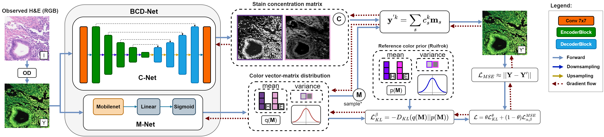

<h1 align='center'> Deep Bayesian Blind Color Deconvolution of Histological Images <br>(ICIP 2023)<br>
    [<a href="https://arxiv.org/abs/2005.08926">arXiv</a>] 
</h1>


<p align="center">

</p>


Histological images are often tainted with two or more stains to reveal their underlying structures and conditions. Separating colors (stains) and structural information (concentrations) is useful for the processing, data augmentation, and classification of such images. To solve this problem, known as Blind Color Deconvolution (BCD), non-_amortized_ techniques have been proposed. These rely on a complicated optimization procedure that has to be carried out on each image. In contrast, once they have been trained, Deep Neural Networks (DNNs) can be used in a fast, amortized manner on unseen inputs. Unfortunately, the lack of large databases of ground truth color and concentrations has limited the development of DNNs for BCD. In this work, we propose BCD-Net, the first Deep Variational Bayesian BCD Neural Network for stain separation and concentration estimation. BCD-Net is trained by maximizing the evidence lower bound of the observed images, which does not require the use of ground truth examples of stains and concentrations. Results obtained using two multicenter databases demonstrate the effectiveness of BCD-Net in the stain separation tasks, while drastically reducing the computation time compared to classical non-amortized methods.

----

### Requirements

See `requirements.txt` for a list of required packages. The experiments were performed with Python 3.9.13 and PyTorch 2.0.1.

### Demonstration

The notebook `inspect.ipynb` loads the weights of the best-performing model from the paper and applies it to a Colon image from the Warwick Stain Separation Benchmark (WSSB) dataset [2]. Reconstructed image, color matrix, concentrations and H&E images are displayed:

### Pretrained model

The pretrained model can be found in [Hugging Face](https://huggingface.co/Franblueee/BCD-Net)

### Replicating the experiments from the paper

BCD-Net can be trained and tested using the file `main.py`. Using the `--help` flag will display the list of all available options. To execute the experiments from the paper, you will need to specify the directory of the Camelyon17 dataset [1] and WSSB dataset. The Camelyon17 dataset can be downloaded from the [Camelyon17 website](https://camelyon17.grand-challenge.org/Data/). The configuration used in the paper is specified in the default values in `options.py`. The experiments from the paper can be approximately replicated using the following commands:

```bash
weights_dir=/path/to/weights
camelyon_dir=/path/to/camelyon17
wssb_dir=/path/to/wssb
theta_val_array=(0.0 0.1 0.2 0.3 0.4 0.5 0.6 0.7 0.8 0.9 1.0)
for theta in "${theta_val_array[@]}"
do
    python code/main.py --mode=train_test --camelyon_data_path=$camelyon_dir --wssb_data_path=$wssb_dir --weights_dir=$weights_dir --theta_val=$theta > output.txt 2>&1
done
```

You can use the flag `--use_wandb` to log the results to [WandB](https://wandb.ai/). You will need to specify your WandB project name in `options.py` or using the flag `--wandb_project_name`. 

Please note that the Camelyon17 dataset was first preprocessed to divide the slides into patches. The preprocessing code is not included in this repository.

[1] Bandi, Peter, et al. "From detection of individual metastases to classification of lymph node status at the patient level: the camelyon17 challenge." IEEE transactions on medical imaging 38.2 (2018): 550-560.

[2] Alsubaie, Najah, et al. "Stain deconvolution using statistical analysis of multi-resolution stain colour representation." PloS one 12.1 (2017): e0169875.


### Citation

If you find this code useful, please consider citing our paper:

```bibtex
@article{,
    title={{D}eep {B}ayesian {B}lind {C}olor {D}econvolution of {H}istological {I}mages},
    author={Shuowen Yang and Fernando Pérez-Bueno and Francisco M. Castro-Macías and Rafael Molina and Aggelos K. Katsaggelos},
    archivePrefix={arXiv},
    primaryClass={stat.ML},
    year={2023}
}
```
